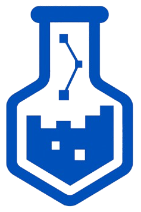

<!-- ABOUT THE PROJECT --> 
[![Contributors][contributors-shield]][contributors-url]
[![Forks][forks-shield]][forks-url]
[![Issues][issues-shield]][issues-url] 
[![Pull Request][pr-shield]][pr-url]
[![Activity][activity-shield]][activity-url] 
[![Stargazers][stars-shield]][stars-url] 

<div align="center"> 
    
    <p>
        A centralized platform that connects RPI students with research and lab opportunities posted by professors and graduate students.
    <p>
</div> 

## Table of Contents

- [About](#about)
- [Contact & License](#contact--license)
- [Built With](#built-with)
  - [Backend](#backend)
  - [Frontend](#frontend)
- [Running Locally](#running-locally)
  - [Backend](#backend-1)
  - [Frontend](#frontend-1)
- [Running with Docker Compose](#running-with-docker-compose)
- [Project Contributors](#project-contributors)
  - [Project Lead](#project-lead)
  - [Rensselaer Center for Open Source Development Team](#rensselaer-center-for-open-source-development-team)
  - [Past Rensselaer Center for Open Source Development Team](#past-rensselaer-center-for-open-source-development-team)
  - [Special Thanks](#special-thanks)


## About

## Contact & License

[](https://discord.gg/tsaxCKjYHT)

Distributed under the Apache License. See [LICENSE](https://github.com/WBroadwell/LabConnect/blob/main/LICENSE) for more information.

### Built With

#### Backend 
[![Python][Python]][Python-url]
[![Flask][Flask]][Flask-url]
[![PostgreSQL][PostgreSQL]][PostgreSQL-url]
[![SQLAlchemy][SQLAlchemy]][SQLAlchemy-url]

#### Frontend
[![TypeScript][TypeScript]][TypeScript-url]
[![React][React]][React-url]
[![Next.js][Next.js]][Next.js-url]
[![Tailwind CSS][TailwindCSS]][TailwindCSS-url]

## Running Locally

### Backend

The backend is a Flask app. From the `backend/` directory:

1. Create and activate a virtual environment:
   ```bash
   python -m venv venv
   source venv/bin/activate  # Windows: venv\Scripts\activate
   ```

2. Install dependencies:
   ```bash
   pip install -r requirements.txt
   ```

3. Copy the example env file and fill in your values:
   ```bash
   cp .env.example .env
   ```

   Key variables:
   - `SQLALCHEMY_DATABASE_URI` — PostgreSQL connection string
   - `SECRET_KEY` — Flask session signing key
   - `JWT_SECRET_KEY` — JWT signing key
   - `FRONTEND_URL` — URL of the frontend (for CORS), default `http://localhost:3000`
   - `FLASK_ENV` — `development`, `production`, or `testing`

4. Run the development server:
   ```bash
   python run.py
   ```

   The backend runs on port `5000` by default.

---

### Frontend

The frontend is a Next.js app. From the `frontend/` directory:

1. Install dependencies:
   ```bash
   npm install
   ```

2. Copy the example env file and fill in your values:
   ```bash
   cp .env.example .env.local
   ```

   Key variables:
   - `BACKEND_URL` — URL of the Flask backend, default `http://localhost:5000`
   - `NEXT_PUBLIC_APP_ENV` — set to `development` to bypass SSO login; `production` enables Shibboleth SSO

3. Run the development server:
   ```bash
   npm run dev
   ```

   The frontend runs on port `3000` by default.

---

## Running with Docker Compose

Docker Compose builds and runs the backend, frontend, and a PostgreSQL database together.

1. Copy the root-level example env file and fill in your values:
   ```bash
   cp .env.example .env
   ```

   Key variables:
   - `DB_PASSWORD` — password for the PostgreSQL database
   - `SECRET_KEY` — Flask session signing key
   - `JWT_SECRET_KEY` — JWT signing key
   - `FRONTEND_URL` — public URL of the frontend (used for CORS and auth redirects)
   - `FLASK_ENV` — `development` or `production` (defaults to `production`)

2. Build and start all services:
   ```bash
   docker compose up --build
   ```

   | Service  | Port |
   |----------|------|
   | Frontend | 3000 |
   | Backend  | 9000 |

3. To stop and remove containers:
   ```bash
   docker compose down
   ```

   To also remove the database volume:
   ```bash
   docker compose down -v
   ```

## Project Contributors

Running list of contributors to the LabConnect project:

### Project Lead

- **Will Broadwell** [Project Lead]

### Rensselaer Center for Open Source Development Team
- **Sarah W** [Backend] (S'24-S'26)


### Past Rensselaer Center for Open Source Development Team

- **Jaswanth D** [Frontend] (F'26)
- **Doan N** [Frontend] (F'26)
- **Pragathi A** [Frontend / Backend] (F'26)
- **Aniket S** [Backend] (F'26)
- **Rafael Cenzano** [Former Project Lead] (F'23-S'25)
- **Mohammed P** [Backend] (S'25)
- **Sagar S** [Frontend] (S'25)
- **Gowrisankar P** [Frontend] (S'25)
- **Devan P** [Frontend] (S'25)
- **Sidarth E** [Frontend] (F'24-S'25)
- **Ramzey Y** [Backend] (S'24-F'24)
- **Siddhi W** [Frontend / Backend] (F'23-F'24)
- **Mrunal A** [Frontend / Backend] (F'23-F'24)
- **Abid T** [Frontend / Backend] (F'23-S'24)
- **Nelson** [Backend] (S'24)
- **Duy L** [Database Systems] (F'23)
- **Yash K** [Frontend] (F'23)
- **Sam B** [Scraping / Integration] (F'23)

### Special Thanks
We extend our special thanks support and opportunity provided by the RCOS community.

[contributors-shield]: https://img.shields.io/github/contributors/WBroadwell/LabConnect.svg?style=for-the-badge
[contributors-url]: https://github.com/WBroadwell/LabConnect/graphs/contributors
[forks-shield]: https://img.shields.io/github/forks/WBroadwell/LabConnect.svg?style=for-the-badge
[forks-url]: https://github.com/WBroadwell/LabConnect/network/members
[stars-shield]: https://img.shields.io/github/stars/WBroadwell/LabConnect.svg?style=for-the-badge
[stars-url]: https://github.com/WBroadwell/LabConnect/stargazers
[issues-shield]: https://img.shields.io/github/issues/WBroadwell/LabConnect.svg?style=for-the-badge
[issues-url]: https://github.com/WBroadwell/LabConnect/issues
[pr-shield]: https://img.shields.io/github/issues-pr/WBroadwell/LabConnect.svg?style=for-the-badge
[pr-url]: https://github.com/WBroadwell/LabConnect/pulls
[activity-shield]: https://img.shields.io/github/last-commit/WBroadwell/LabConnect?style=for-the-badge
[activity-url]: https://github.com/WBroadwell/LabConnect/activity

<!-- LINKS & IMAGES -->
[Python]: https://img.shields.io/badge/Python-3776AB.svg?style=for-the-badge&logo=Python&logoColor=white
[Python-url]: https://www.python.org/
[Flask]: https://img.shields.io/badge/Flask-000000?style=for-the-badge&logo=flask&logoColor=white
[Flask-url]: https://flask.palletsprojects.com/en/3.0.x/
[PostgreSQL]: https://img.shields.io/badge/PostgreSQL-336791?style=for-the-badge&logo=postgresql&logoColor=white
[PostgreSQL-url]: https://www.postgresql.org/
[SQLAlchemy]: https://img.shields.io/badge/SQLAlchemy-000000?style=for-the-badge&logo=sqlalchemy&logoColor=white
[SQLAlchemy-url]: https://www.sqlalchemy.org/

[TypeScript]: https://img.shields.io/badge/TypeScript-3178C6?style=for-the-badge&logo=typescript&logoColor=white
[TypeScript-url]: https://www.typescriptlang.org/
[React]: https://img.shields.io/badge/React-61DAFB?style=for-the-badge&logo=react&logoColor=black
[React-url]: https://reactjs.org/
[Next.js]: https://img.shields.io/badge/Next.js-000000?style=for-the-badge&logo=next.js&logoColor=white
[Next.js-url]: https://nextjs.org/
[TailwindCSS]: https://img.shields.io/badge/Tailwind_CSS-38B2AC?style=for-the-badge&logo=tailwind-css&logoColor=white
[TailwindCSS-url]: https://tailwindcss.com/